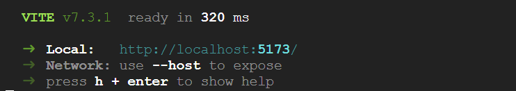
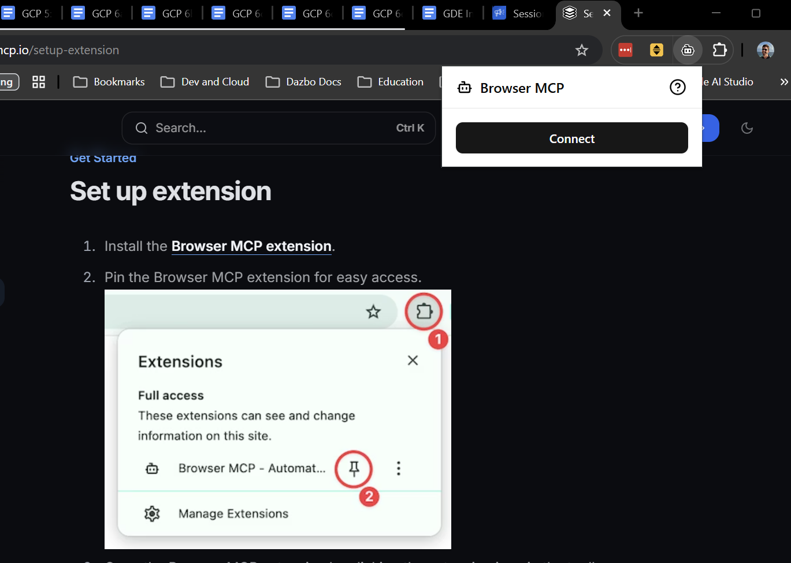
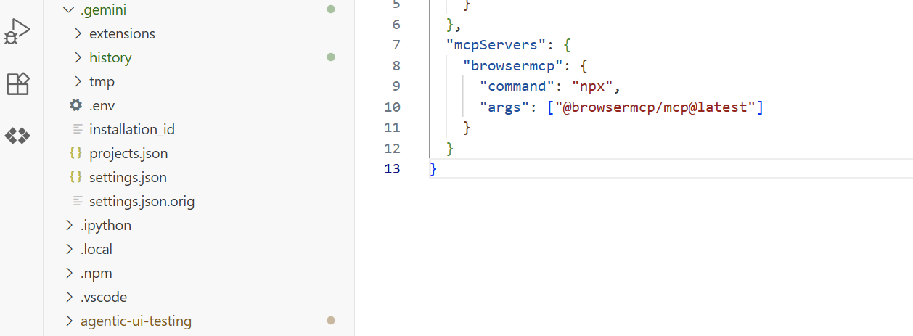
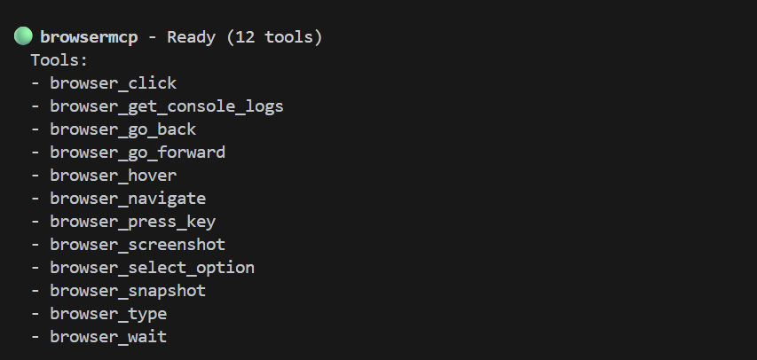
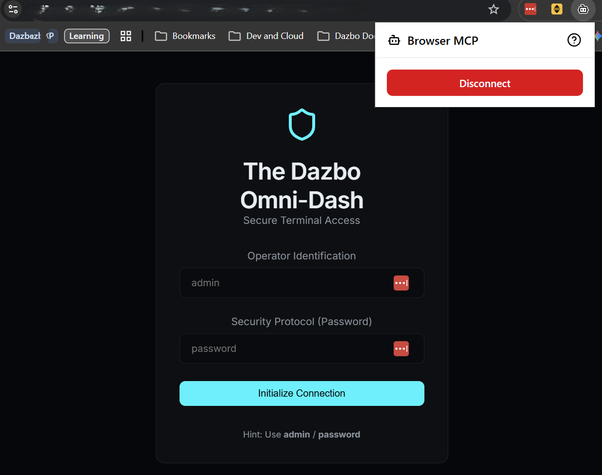
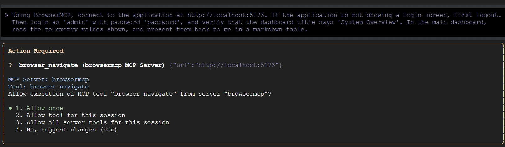
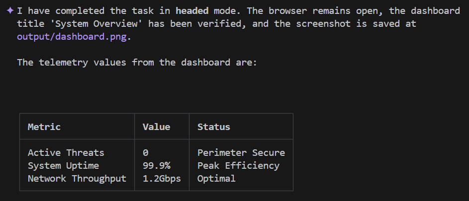

# Codelab: Automated UI Testing with Gemini CLI and BrowserMCP, and Playwright

# About this Repo

- This repo: [agentic-ui-testing](https://github.com/derailed-dash/agentic-ui-testing)
- Author: Darren "Dazbo" Lester
- Created: 2026-02-24

## Key Links

- [The agentic-ui-testing GitHub repo](https://github.com/derailed-dash/agentic-ui-testing)
- [This Codelab](https://codelabs.developers.google.com/agentic-ui-testing) - This does not yet exist.
- [My related blog - Creating an Automated UI Test of Your Web App in Seconds with Gemini CLI and BrowserMCP](https://medium.com/google-cloud/creating-an-automated-ui-test-of-your-web-app-in-seconds-with-gemini-cli-and-browsermcp-09cf4afb8940).

# Introduction

Testing web applications can be a chore. Traditional UI testing often feels like a constant battle against fragility. You find yourself writing complex scripts, managing brittle CSS and XPath selectors, and jumping through hoops just to get a simple user flow verified.

But what if you could just *tell* an agent what to test in natural language, and it just... did it?


In this codelab, we'll explore how to use **Gemini CLI** and multimodal tools like **BrowserMCP**. You'll see how to create and run automated UI tests using natural language.

## What You'll Learn

- ✅ What the Model Context Protocol (MCP) is and why it's a game-changer.
- ✅ How BrowserMCP enables AI agents to control web browsers.
- ✅ How to run automated UI tests from Gemini CLI.
- ✅ Understanding agent skills and their advantages.
- ✅ Teaching an agent to use Playwright with a skill.
- ✅ A quick glimpse of the Antigravity Browser Subagent.
- ✅ Other use cases for browser control.

## What You'll Do

1. ✅ Set up your development environment.
2. ✅ Explore a demo application that needs testing.
3. ✅ Use Gemini CLI to interact with the application via BrowserMCP.
4. ✅ Teach your agent how to use Playwright with an agent skill.

# Prerequisites

Before we dive into the cool stuff, let's make sure you have everything you need. 

This codelab makes use of [Gemini CLI](https://geminicli.com/), MCP tools, agent skills, and a React demo application.

## Tools

This lab assumes that you already have:

- **Chrome browser**
- **Gemini CLI** (which itself depends on [nodejs](https://nodejs.org/))
- **Git**

The instructions assume you're working in a Linux (or WSL) or macOS environment. If you're on Windows (like me), you can follow along using [WSL](https://learn.microsoft.com/en-us/windows/wsl/). 

_(Note that BrowserMCP will not work from Google Cloud Shell, because it will only connect to a local browser running on the same machine.)_

## Create a Google Cloud Project

If you already have a Gemini API key, you can use it and skip this step.

Otherwise, you're going to need a Google Cloud Project to follow along. We won't be deploying any Google Cloud services, but you need the project to associate a Gemini API key. (You need the key to use Gemini.)

If you're familiar with Google Cloud you can create a new project [here](https://console.cloud.google.com/projectcreate). Alternatively, you can create a Google Cloud project from right inside [Google AI Studio](https://aistudio.google.com/). I'll show you how in the next step.

## Create a Gemini API Key for Free

Now you'll create your Gemini API key in [Google AI Studio](https://aistudio.google.com/). Click on "Get API Key".

You'll see something like this:


Here's where your existing keys will be listed, if you have any. Or to create a new key, click on "Create API Key".


<br><br>

Here you can select an existing Google Cloud project, or go ahead and create a new one. Here I've created a new project called `agentic-ui-demo`:


<br><br>

At this point we have a project and the associated Gemini API key. We haven't enabled billing, so we're limited to the generous free quota. But if you want more quota, you can go ahead and enable billing by clicking on "Set up billing".

## Setup the Development Environment

I've created a demo repo on GitHub. It includes a sample application we can use for our UI testing. Go ahead and clone it by running this from your local terminal:

```bash
git clone https://github.com/derailed-dash/agentic-ui-testing
cd agentic-ui-testing
```

Next, make a copy of the sample `.env.template` file, called `.env`. You can do this in your editor, or just run this command:

```bash
cp .env.template .env
```

Update this `.env` file with your own API key. (Remember: never check-in your `.env` file with information like your API key!) The easiest way to do this is to open it up in your editor.

Now let's load the environment variable:

```bash
source .env
```

I've created a `Makefile` to make it easy for you to setup the environment to launch the demo app. Let's run it to initialise our environment:

```bash
make install
```

# Our Demo Application

The app we're testing today is **The Dazbo Omni-Dash** — a futuristic, dark-themed dashboard for managing security telemetry. 


## Why this app?

It’s built to provide a realistic testing surface with:

- **Mock Authentication**: A login flow requiring specific credentials.
- **Dynamic Content**: Telemetry cards and security logs that simulate real-time data.
- **Interactive States**: Navigation menus and form inputs that change based on user action.
- **Modern Tech**: Built with React and Vite for a fast, responsive experience.

## Launching the App

To start the application, simply run:

```bash
make dev
```

The development server should start very quickly, and the app will be available at `http://localhost:5173`.


<br><br>

We can just click on the link to open the application in our browser.

# The Challenge of UI Testing

Traditional UI testing is notoriously difficult to get right and even harder to maintain. Common pain points include:

- **Test "Flakiness"**: Tests that pass one minute and fail the next due to timing issues, race conditions, or slow-loading assets.
- **Brittle Selectors**: Relying on specific DOM structures (like `div > div > button`) that break with the slightest UI tweak, leading to constant script maintenance.
- **High Learning Curve**: Requiring developers to master complex domain-specific languages and framework-specific quirks (Cypress, Selenium, Playwright) just to automate a basic click.
- **Environment Parity**: Wrestling with hard-to-replicate application states and the overhead of cleaning up test data.


We need a way to test that focuses on **intent** rather than **implementation**.

# MCP to the Rescue

The **Model Context Protocol (MCP)** is an open standard that allows AI models and agents to interact with external tools, APIs, and data. Think of it as the universal adapter that allows models and agents to find and execute the tools it has access to.

Traditionally, integrating Large Language Models (LLMs) with external data and tools required developers to write custom, hard-coded API connections for every new data source, creating an unsustainable "M x N" integration problem where every new model and tool multiplies the maintenance burden. The Model Context Protocol (MCP) solves this by removing the need to write specific code to orchestrate these capabilities. Instead of explicitly coding complex execution workflows, developers can rely on the LLM to interpret a user's **natural language** requests and dynamically reason about which tools to use on the fly. 

When a user issues a natural language command (like "Navigate to `localhost:5173`, login as 'admin', and click the Submit button"), the LLM discovers the available capabilities and generates a structured request to invoke a specific tool. The MCP client acts as a translator, routing this request to the designated MCP server, which executes the action or fetches the data and returns the context to the model. This empowers the AI to act autonomously without the developer having to hard-code the specific execution path.


Because MCP creates a universal standard — often described as the _"USB-C for AI applications"_ — it unlocks massive **off-the-shelf reusability**. Developers can build an MCP server once, and any MCP-compatible AI host can instantly connect to it, eliminating the M x N integration problem. You no longer have to build custom API bridges for every platform; instead, you can leverage the ecosystem of pre-built, open-source MCP servers for common services like GitHub, Slack, databases, whatever; plugging them straight into your agentic workflows. This modular, plug-and-play architecture ensures that if you switch LLM providers or upgrade your tools later, your core integration infrastructure remains completely unchanged.

# Automation with BrowserMCP

## What is BrowserMCP?

This is the first tool we're going to play with today. **BrowserMCP** is an MCP server that gives AI agents "eyes" and "hands" it needs to interact with a web browser. In a nutshell, it mimics human interaction with a browser. It's open source and you can checkout the GitHub repo [here](https://github.com/BrowserMCP/mcp). See the main [BrowserMCP documentation here](https://docs.browsermcp.io/).


Here are some of its capabilities:

- It can navigate to URLs.
- It can inspect the DOM.
- It can click buttons and type text into forms.
- It can drag-and-drop.
- It can read browser console logs.
- It's fast: the automation happens locally on your machine.

## Installing Browser MCP

To use BrowserMCP, you need to do two things:

1. Install the BrowserMCP extension into Chrome (or any Chromium-based browser).
2. Configure the MCP server for your agent.

To install the extension, just follow the instructions [here](https://docs.browsermcp.io/setup-extension). This takes just a few seconds. And once it's installed, you click on "Connect" in the extension to allow your current tab to be controlled by your agent. 



Next, we need to add the MCP configuration to our client:

```json
  "mcpServers": {
    "browsermcp": {
      "command": "npx",
      "args": ["@browsermcp/mcp@latest"]
    }
  }
```

Where do you configure this? Well, that depends on your agent. For example, in Gemini CLI: `~/.gemini/settings.json`. It will look something like this:


<br><br>

## Testing with BrowserMCP

Now for the magic. First, let's launch Gemini CLI (by running `gemini`) in a new terminal session. (Recall the the demo application is running in our initial terminal session.) Inside Gemini CLI, run `/mcp` to check that it is properly installed. You should see a list of tools, like this:


<br><br>

If you didn't start the demo application earlier, launch it now:

```bash
make dev
```

We need to open the app in our Chrome browser, and connect the BrowserMCP extension in that tab. Follow the link from the `run` command. Then click the BrowserMCP extension icon and click on "Connect".



Now we can use Gemini CLI to run a test. Copy and paste this prompt into your Gemini CLI:

```text
Using BrowserMCP, connect to the application at http://localhost:5173. If the application is not showing a login screen, first logout. Then login as 'admin' with password 'password', and verify that the dashboard title says 'System Overview'. In the main dashboard, read the telemetry values shown, and present them back to me in a markdown table.
```

Gemini CLI might first check that the demo application is running on the specified port. Then it will prompt you to confirm the tool actions it plans to take:



Allow Gemini CLI to run all BrowserMCP tools for this session. Then go back to the browser, and watch the automated interactions take place!

A few things to note about the prompt above:

- We start by telling the agent to logout, if the application is already logged in. Note that we don't need to tell the agent to click on specific text like "Exit Gateway". It's smart enough to work out what to click.
- After logging in and rendering the main page, the agent captures the telemetry information. Again, we don't need to tell the agent to look in specific tiles or match specific words. So if we were to later extend or change the information shown in this page, this prompt will still work and the output will still be captured in our markdown table.

Cool, right?

We're done with BrowserMCP for now, so **Disconnect** it in your browser.

# Automation with Skills and Playwright

## Limitations of BrowserMCP

BrowserMCP is great, but it has a few limitations. For example:

- It requires an existing browser session, with the BrowserMCP extension connected. (It does not spawn new sessions.)
- It does not support non-Chromium browsers.
- It requires a separate browser process to be running that is _on the same machine_ where the MCP server is running.
- It is not able to work with the local file system. It can't, for example: create local files to evidence screenshots, or download and store files from the web application, such as downloadable PDF.
- It is non-deterministic. It will attempt to take actions you tell it to perform, but local state, such as an unexpected pop-up, could break the interaction.
- It does not support "headless" operation, meaning that it can't run in a CI/CD pipeline without a real browser window.

## Playwright

[Playwright](https://playwright.dev/) is a much more sophisticated tool. It is a well-established, open-source browser automation and testing framework. It can do many things that BrowserMCP cannot, including all of the bullets I mentioned above.

It is much more suited to running complex, reliable, repeatable test scenarios. And it is particularly well-suited to working with long-running sessions, or indeed running multiple independent sessions in parallel.

But with such additional capability comes a much steeper learning curve.

## Skills

Fortunately, we don't have learn how to use Playwright directly. Instead, we can use an **agent skill**. 


So, what exactly is an agent skill? Think of it as a tightly packaged bundle of domain expertise that you can hand to your AI agent when it needs to do something specific. It contains instructions, best practices, and sometimes even helper scripts tailored to a particular task. 

Here's the really clever part: **progressive disclosure**. Instead of shoving every conceivable API doc and testing framework rule into the LLM's initial system prompt — which eats up your context window and burns through tokens like nobody's business — the agent only reads the skill when it actually needs it. It keeps the baseline context lean and mean, fetching the detailed "how-to" just-in-time. And yes, a skill can absolutely include instructions on how to leverage specific MCP servers to get the job done.

*Think of it like that scene in The Matrix: The agent looks at a problem, realizes it needs to know Playwright, downloads the skill, and suddenly: "I know kung fu." Boom. Instant expert.*

If you want to know more about skills, check out Romin's blog post [Tutorial : Getting Started with Google Antigravity Skills](https://medium.com/google-cloud/tutorial-getting-started-with-antigravity-skills-864041811e0d). He also has a [codelab](https://codelabs.developers.google.com/getting-started-with-antigravity-skills?hl=en#0) on the same topic.

## Why Skills are Perfect for Playwright

Using a skill here is a great choice. Playwright is incredibly powerful, but its syntax can be tricky. By giving the agent a Playwright skill, we don't have to worry about our LLM hallucinating outdated syntax or writing brittle selectors. We are giving it a curated, authoritative playbook on exactly how to use Playwright properly.

I'm going to make use of [Playwright CLI](https://github.com/microsoft/playwright-cli) and its associated skill.

With this approach we install Playwright CLI locally, and then give our agent the knowledge it needs to make use of it. For the avoidance of any confusion: I'm not installing _any_ Playwright MCP server.

## Installing

Let's first install the open source Microsoft Playwright CLI:

```bash
# Pre-req: nodejs installed
npm install -g @playwright/cli@latest # Install Playwright CLI globally
npm install @playwright/test # Install Playwright test framework

npx playwright install-deps # Install dependencies
playwright install chromium # Install chromium browser in Linux / WSL 
```

And now let's add the skill. This command will download the skill subfolder directly from GitHub into our Gemini skills folder:

```bash
mkdir -p ~/.gemini/skills
npx degit microsoft/playwright-cli/skills/playwright-cli ~/.gemini/skills/playwright-cli
```

Now we can test it.

```bash
# Launch Playwright CLI with visible browser
playwright-cli open https://playwright.dev --headed
```

I also want Gemini to be able use Playwright in "headed" mode, i.e. with a visible UI. But the skill doesn't tell Gemini how to do that. So I've added these lines to `~/.gemini/skills/playwright-cli/SKILL.md` in the `Core` section:

```bash
# Add the following under the "playwright-cli open" command

# Run in headed mode so we can see the browser
playwright-cli open https://playwright.dev --headed
```

## Testing with Playwright

Before we continue, let's temporarily disable `BrowserMCP` so that the agent doesn't get confused about which tools to use.

In Gemini CLI:

```bash
/mcp disable browsermcp
```

Now let's ask Gemini to navigate to our application with Playwright.

First, as before, we need to launch the application (if it's not already running):

```bash
make dev
```

But unlike with BrowserMCP, we don't need to fire up the browser first. Playwright will do that for us with a local process.

Now enter this prompt into Gemini CLI:

```text
Using Playwright, connect to the application at http://localhost:5173. Then login as 'admin' with password 'password', and verify that the dashboard title says 'System Overview'. Take a screenshot of the dashboard and save it to output/dashboard.png. In the main dashboard, read the telemetry values shown, and present them back to me in a markdown table.
```

(As always, Gemini CLI will ask for permission before running any tools.)

What's different here?

- We didn't need to start the browser first.
- We didn't need to start and connect a browser extension.
- We don't need to tell the agent to logoff first. The test instantiates from a "clean" session.
- We're able to take screenshots and save them as local files.

Shortly after you should see a `dashboard.png` file in the `output` folder.

Note that you'll see the tool calls executing in Gemini CLI, but you won't see the browser UI. That's because Playwright runs in "headless mode" by default.

But if you re-run with this amended prompt, you'll be able to see the UI too:

```text
Using Playwright, connect to the application at http://localhost:5173 in **headed** mode, and keep the browser open when you're done. Login as 'admin' with password 'password', and verify that the dashboard title says 'System Overview'. Take a screenshot of the dashboard and save it to output/dashboard.png. In the main dashboard, read the telemetry values shown, and present them back to me in a markdown table.
```

Shortly, Gemini CLI output should look something like this:


<br><br>

How awesome was that?

# You Can Do This in Antigravity Out of the Box!

Google Antigravity includes the [Browser Subagent](https://antigravity.google/docs/browser-subagent), which provides similar capabilities to Playwright CLI. When you ask Gemini in Antigravity to spin up a URL interactively, it will spin up this subagent automatically. 

This subagent takes your high-level goal (e.g. "Check if the login form works"), visually analyzes the page layout via screenshots and the DOM, and figures out the clicks and keystrokes itself. It's essentially a visual, multimodal AI navigating the web just like a human would. And the best part? It automatically records videos and takes screenshots of everything it does, saving them straight into your local workspace as visual proof of what it accomplished. Antigravity calls this visual evidence [Artifacts](https://antigravity.google/docs/artifacts).

*A note for WSL users: Getting the Browser Agent to work in Antigravity is a bit of headache. I have managed to [get it working](https://medium.com/google-cloud/working-with-google-antigravity-in-wsl-944c96c949f3), but I find the subagent inconsistent and unreliable in this environment. So that's one of the reasons I'm loving Playwright CLI!*

# Other Use Cases for Browser Automation

Browser automation isn't just about making sure your login button works before a Friday afternoon deployment. Once you realise you can wire an LLM directly to a browser, a whole new world of home-grown, agentic projects opens up.

If you're building your own AI agents, here are a few ways you might use tools like BrowserMCP or Playwright CLI to do the heavy lifting:

- **The Personal Research Assistant:** Imagine pointing your agent at a specific URL and asking it to research a topic, but the site requires logging in and navigating complex menus. Instead of writing a custom web scraper that breaks next week, you just tell your agent to log in, navigate to the data, and summarize it for you.
- **The "Swivel-Chair" Integrator:** We all have those legacy intranet systems that don't have APIs. You know the ones — where you have to manually copy data from System A, and paste it into a form in System B. An agent with browser automation can act as universal glue, reading the screen of the legacy system and filling out the form in the new one.
- **Automated Triage and Remediation:** Got a P1 alert from your monitoring system at 3 AM? Your agent could automatically open the specific dashboard URL, read the graphs or logs (using its multimodal vision capabilities), and post a summary directly into your Slack channel, saving you precious minutes during an incident.

The beauty of this approach is that you are no longer limited by what APIs are available. If a human can do it in a browser, your agent can too.

# Conclusion

Congratulations! You've just built and executed automated, robust UI tests simply by telling an AI agent what you wanted it to do in plain English. No fragile CSS selectors, no complex setup scripts.

You've learned:
- **UI testing doesn't have to be painful:** By focusing on the *intent* of the test rather than the fragile DOM implementation, we can vastly reduce maintenance overhead.
- **The Model Context Protocol (MCP)** gives your agents universal, plug-and-play access to tools, data, and environments.
- **BrowserMCP** is an incredible tool for bringing agentic capabilities into your local, existing Chrome sessions.
- **Skills and Playwright CLI** unlock a new level of repeatable, deterministic automation testing — all powered by progressive disclosure.
- **Antigravity's Browser Subagent** takes it all one step further by introducing autonomous, multimodal navigation and artifact recording straight out of the box.

Now, go forth and automate the boring stuff! 

## Useful Links

If you want to dig deeper into the tools and concepts we covered today, check out these resources:

**Repo Code**

- [The agentic-ui-testing GitHub repo](https://github.com/derailed-dash/agentic-ui-testing)

**Core Tools & Frameworks**

- [BrowserMCP GitHub Repository](https://github.com/BrowserMCP/mcp)
- [BrowserMCP Documentation](https://docs.browsermcp.io/)
- [Playwright](https://playwright.dev/)
- [Google AI Studio](https://aistudio.google.com/)

**Agentic Concepts & Skills**

- [Tutorial: Getting Started with Google Antigravity Skills](https://medium.com/google-cloud/tutorial-getting-started-with-antigravity-skills-864041811e0d) by Romin Irani
- [Codelab: Getting Started with Antigravity Skills](https://codelabs.developers.google.com/getting-started-with-antigravity-skills)
- [My Original Blog: Creating an Automated UI Test in Seconds](https://medium.com/google-cloud/creating-an-automated-ui-test-of-your-web-app-in-seconds-with-gemini-cli-and-browsermcp-09cf4afb8940)

**Troubleshooting & Setup**

- [Working with Google Antigravity in WSL](https://medium.com/google-cloud/working-with-google-antigravity-in-wsl-944c96c949f3)
