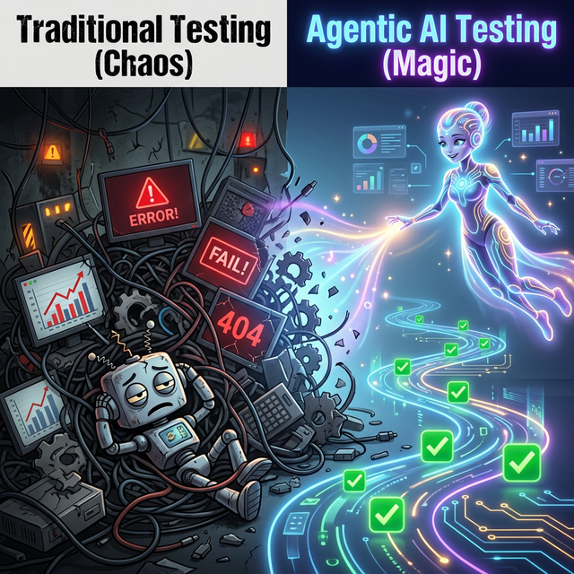
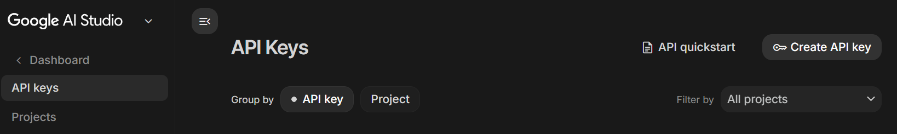
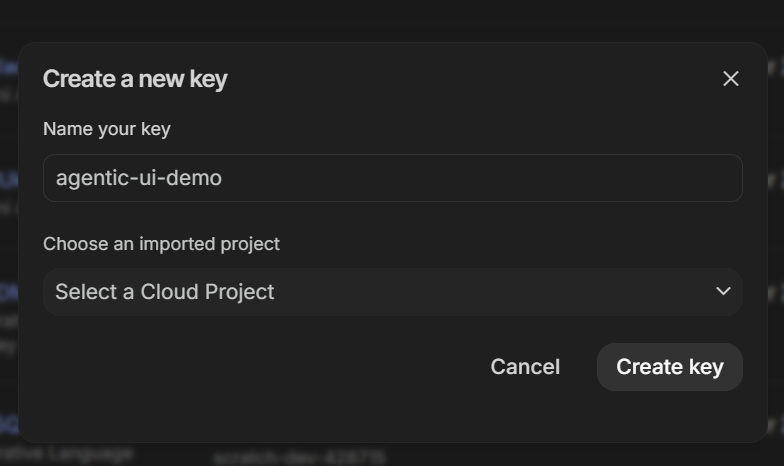
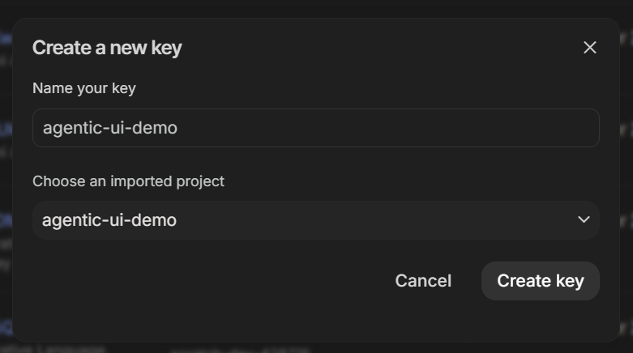
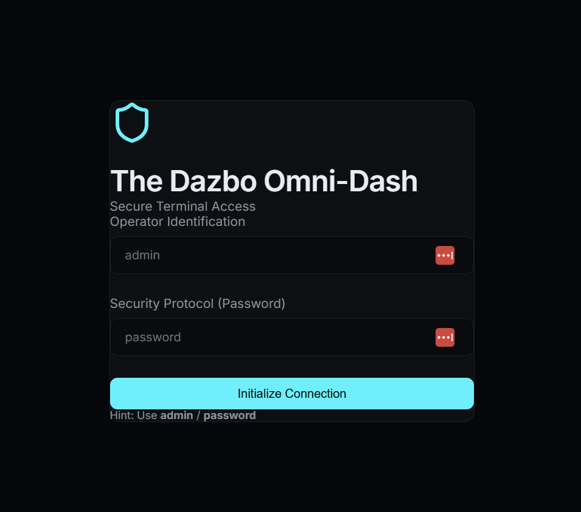
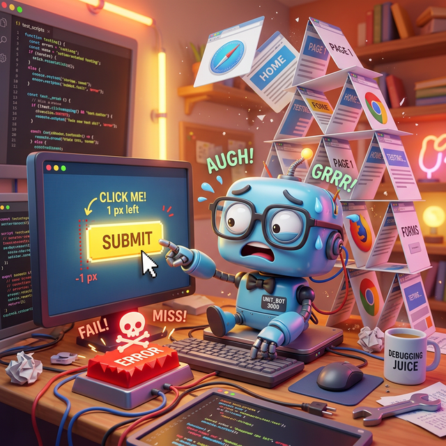
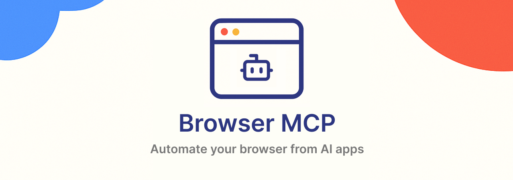

# Codelab: Automated UI Testing with Gemini CLI and BrowserMCP

# About this Repo

- This repo: [agentic-ui-testing](https://github.com/derailed-dash/agentic-ui-testing)
- Author: Darren "Dazbo" Lester
- Created: 2026-02-24

## Key Links

- [My related blog - Creating an Automated UI Test of Your Web App in Seconds with Gemini CLI and BrowserMCP](https://medium.com/google-cloud/creating-an-automated-ui-test-of-your-web-app-in-seconds-with-gemini-cli-and-browsermcp-09cf4afb8940).
- [Google Codelabs](https://codelabs.developers.google.com/)
- [This Codelab](https://codelabs.developers.google.com/agentic-ui-testing) - This does not yet exist.

# Introduction



Testing web applications can be a chore. Traditional UI testing often feels like a constant battle against fragility. You find yourself writing complex scripts, managing brittle CSS and XPath selectors, and jumping through hoops just to get a simple user flow verified.

But what if you could just *tell* an agent what to test in natural language, and it just... did it?

In this codelab, we'll explore how to use **Gemini CLI** and multimodal tools like **BrowserMCP**. You'll see how to create and run automated UI tests using natural language.

## What You'll Learn

- ✅ What the Model Context Protocol (MCP) is and why it's a game-changer.
- ✅ How BrowserMCP enables AI agents to control web browsers.
- ✅ How to run automated UI tests from the Gemini CLI.
- ✅ Understanding skills.
- ✅ Now performing our UI tests with Playwright and a skill.
- ✅ A quick glimpse of doing this with Antigravity, out-of-the-box.
- ✅ Other use cases for browser control.

## What You'll Do

1. ✅ Set up your development environment.
2. ✅ Explore a demo application that needs testing.
3. ✅ Use Gemini CLI to interact with the application via BrowserMCP.
4. ✅ Generate a Playwright test script using an AI skill.
5. ✅ Antigravity Browser Control demo.

# Prerequisites

Before we dive into the cool stuff, let's make sure you have everything you need.

## Clone the Demo Repo

I've created a demo repo on GitHub. It includes a sample application we can use for our UI tewsting. Go ahead and clone it:

```bash
git clone https://github.com/derailed-dash/agentic-ui-testing
cd agentic-ui-testing
```

## Create a Google Cloud Project

If you already have a Gemini API key, you can use it and skip this step.

Otherwise, you're going to need a Google Cloud Project to follow along. We won't be deploying any Google Cloud services, but you need the project to associate a Gemini API key. (You need the key to use Gemini.)

If you're familiar with Google Cloud you can create a new project [here](https://console.cloud.google.com/projectcreate). 

Alternatively, you can create a Google Cloud project from right inside [Google AI Studio](https://aistudio.google.com/)! I'll show you how in the next step.

## Create a Gemini API Key for Free

Now you'll create your Gemini API key in [Google AI Studio](https://aistudio.google.com/). Click on "Get API Key".

You'll see something like this:



Here's where your existing keys will be listed, if you have any. Or to create a new key, click on "Create API Key".



Here you can select an existing Google Cloud project, or go ahead and create a new one. Here I've created a new project called `agentic-ui-demo`:



At this point we have a project and the associated Gemini API key. We haven't enabled billing, so we're limited to the generous free quota. But if you want more quota, you can go ahead and enable billing by clicking on "Set up billing".

Now that we've got our key, we need to load it into our local development environment. Make a copy of the sample `.env.template` file, called `.env`. You can do this in your editor, or just run this command:

```bash
cp .env.template .env
```

Update this `.env` file with your own API key. (Remember: never check-in your `.env` file with information like your API key!)

Now let's load the environment variable:

```bash
source .env
```

## Finishing the Development Environment Setup

This codelab uses some MCP tools, agentic skills, and a React demo application.

I've created a `Makefile` to make it easy for you to setup the environment to launch the demo app. Let's run it, and initialise our 

```bash
# Install dependencies
make install

# Load environment variables
source .env
```

# Our Demo Application

The app we're testing today is **The Dazbo Omni-Dash** — a futuristic, dark-themed dashboard for managing security telemetry. 



## Why this app?

It’s built to provide a realistic testing surface with:

- **Mock Authentication**: A login flow requiring specific credentials.
- **Dynamic Content**: Telemetry cards and security logs that simulate real-time data.
- **Interactive States**: Navigation menus and form inputs that change based on user action.
- **Modern Tech**: Built with React and Vite for a fast, responsive experience.

## Launching the App

To start the application, simply run:

```bash
make dev
```

The development server should start very quickly, and the app will be available at `http://localhost:5173`.

# The Challenge of UI Testing



Traditional UI testing is notoriously difficult to get right and even harder to maintain. Common pain points include:

- **Test "Flakiness"**: Tests that pass one minute and fail the next due to timing issues, race conditions, or slow-loading assets.
- **Brittle Selectors**: Relying on specific DOM structures (like `div > div > button`) that break with the slightest UI tweak, leading to constant script maintenance.
- **High Learning Curve**: Requiring developers to master complex domain-specific languages and framework-specific quirks (Cypress, Selenium, Playwright) just to automate a basic click.
- **Environment Parity**: Wrestling with hard-to-replicate application states and the overhead of cleaning up test data.

We need a way to test that focuses on **intent** rather than **implementation**.

# MCP to the Rescue

## Introduction to MCP

The **Model Context Protocol (MCP)** is an open standard that allows AI models and agents to safely and easily interact with external tools, APIs, and data. Think of it as the universal adapter that allows models and agents to find and execute the tools it has access to.

Traditionally, integrating Large Language Models (LLMs) with external data and tools required developers to write custom, hard-coded API connections for every new data source, creating an unsustainable "M x N" integration problem where every new model and tool multiplies the maintenance burden. The Model Context Protocol (MCP) solves this by removing the need to write specific code to orchestrate these capabilities. Instead of explicitly coding complex execution workflows, developers can rely on the LLM to interpret a user's **natural language** requests and dynamically reason about which tools to use on the fly. 

When a user issues a natural language command (like "Find the latest sales report and email it"), the LLM discovers the available capabilities and generates a structured request to invoke a specific tool. The MCP client acts as a translator, routing this request to the designated MCP server, which executes the action or fetches the data and returns the context to the model. This empowers the AI to act autonomously without the developer having to hard-code the specific execution path.


Because MCP creates a universal standard — often described as the _"USB-C for AI applications"_ — it unlocks massive **off-the-shelf reusability**. Developers can build an MCP server once, and any MCP-compatible AI host can instantly connect to it, eliminating the M x N integration problem. You no longer have to build custom API bridges for every platform; instead, you can leverage the ecosystem of pre-built, open-source MCP servers for common services like GitHub, Slack, databases, whatever; plugging them straight into your agentic workflows. This modular, plug-and-play architecture ensures that if you switch LLM providers or upgrade your tools later, your core integration infrastructure remains completely unchanged.

## What is BrowserMCP?

This is the first tool we're going to play with today. **BrowserMCP** is an MCP server that gives AI agents "eyes" and "hands" it needs to interact with a web browser. In a nutshell, it mimics human interaction with a browser.



Here are some of its capabilities:

- It can navigate to URLs.
- It can click buttons and type text into forms.
- It can inspect the DOM.
- It's fast: the automation happens locally on your machine.

It's open source and you can checkout the GitHub repo [here](https://github.com/BrowserMCP/mcp).

## Installing Browser MCP

tbc

# Section 5: Running the Test

Now for the magic. We'll use the `gemini` CLI to run a test.

```bash
gemini "Go to http://localhost:3000, login as 'admin' with password 'password', and verify that the dashboard title says 'Welcome Back'."
```

Gemini will use BrowserMCP to perform these actions and report back. No code required.

# Section 6: Automation with Playwright Skill

Once you're happy with the manual flow, you might want to bake it into a CI/CD pipeline. We can use a **Playwright Skill** to convert our natural language intent into a robust, repeatable Playwright script.

# Section 7: You Can Do This in Antigravity!

The experience you see in the CLI is even more powerful within **Antigravity**, Google's agentic coding assistant. Antigravity integrates these tools directly into your workflow, allowing for even tighter feedback loops.

# Section 8: Other Use Cases

Browser control isn't just for testing. You can use it for:
- Data scraping.
- Automating repetitive web tasks (like filling out expense reports).
- Web research and summarization.

# Conclusion

Congratulations! You've seen how AI agents, powered by MCP and BrowserMCP, can transform the way we think about UI testing.

You've learned:
- **UI testing doesn't have to be painful.**
- **MCP** provides a standardized way for agents to use tools.
- **BrowserMCP** lets agents interact with the web just like a human.
- **Gemini CLI and Antigravity** make these capabilities accessible and powerful.

Now, go forth and automate the boring stuff!
