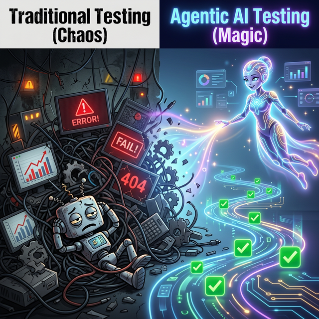
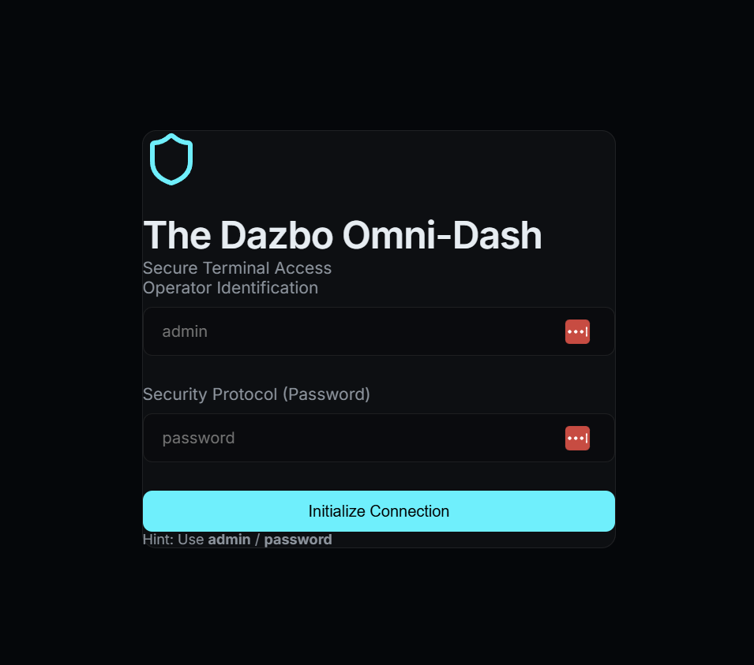
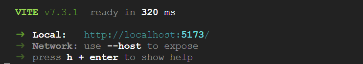
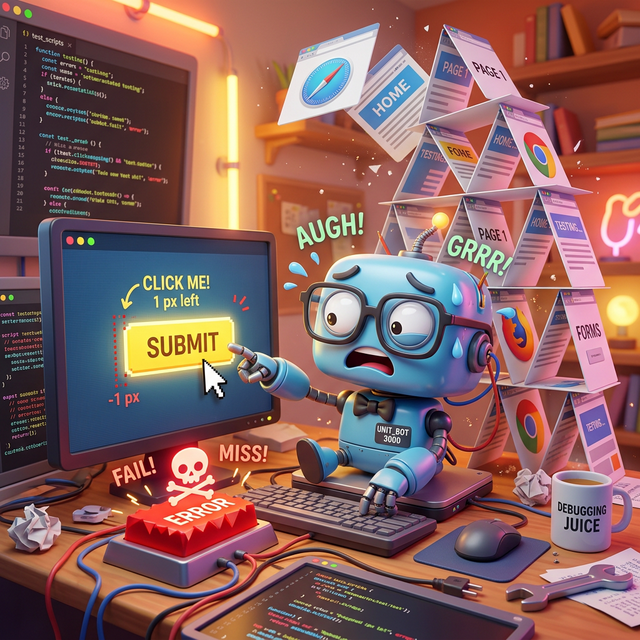
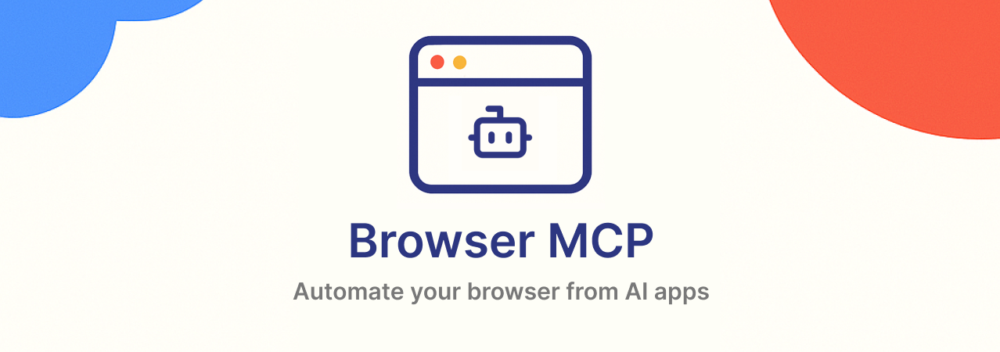
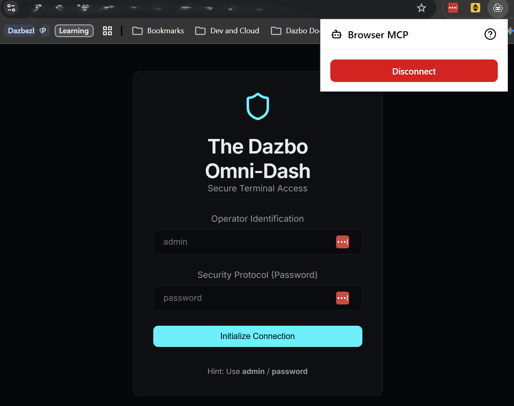
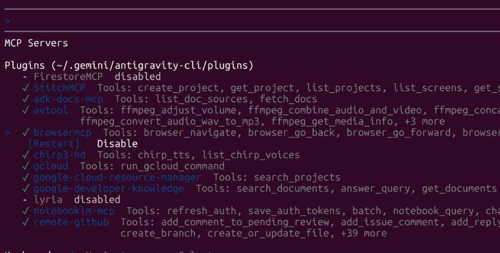
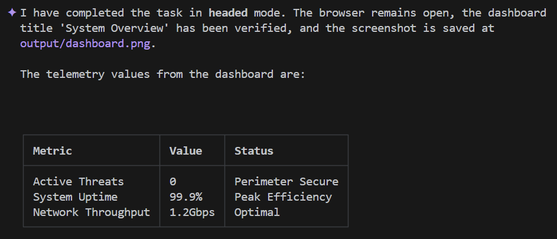

# Google Developer Codelab: Automated UI Testing with Antigravity (Agy) CLI, BrowserMCP, Playwright, and the Browser Agent

# About this Repo

- This repo: [agentic-ui-testing](https://github.com/derailed-dash/agentic-ui-testing)
- Author: Darren "Dazbo" Lester
- Created: 2026-02-24

## Key Links

- [The agentic-ui-testing GitHub repo](https://github.com/derailed-dash/agentic-ui-testing)
- [This Codelab](https://codelabs.developers.google.com/agentic-ui-testing-with-antigravity-cli)
- [My related blog - Creating an Automated UI Test of Your Web App in Seconds with Gemini CLI and BrowserMCP](https://medium.com/google-cloud/creating-an-automated-ui-test-of-your-web-app-in-seconds-with-gemini-cli-and-browsermcp-09cf4afb8940).

# Introduction

The agentic AI revolution is transforming how we build software, making the entire process feel incredibly cool, exciting, and accessible. Tasks and projects that would have previously taken developers months to complete can now be achieved in a single session using agentic tools. 

One area ripe for this agentic transformation is web application testing. Traditionally, testing web apps has been a chore and a constant battle against fragility. But what if you could bypass that complexity entirely? What if you could simply *tell* an agent what to test in plain, natural language, and let the agent reason about how to execute it?



In this codelab, we'll explore how to use **Antigravity CLI** along with agent skills, and multimodal MCP tools like **BrowserMCP**. You'll see how to create and run automated UI tests using natural language, showing how agentic tools can handle complex tasks and give you superpowers as a builder.

Crucially, whilst this codelab focuses on the specific use cases of UI automation and browser remote control, it is the underlying principles and the massive world of possibilities they unlock that are truly important. By teaching agents to use local CLIs, external MCP servers, and APIs, we can delegate complex workflows that we wouldn't otherwise have the time or specialised expertise to handle ourselves.

## What You'll Learn

- ✅ What is Antigravity CLI and where does it live in the Antigravity ecosystem?
- ✅ What the Model Context Protocol (MCP) is and why it's a game-changer.
- ✅ How BrowserMCP enables AI agents to control web browsers.
- ✅ How to run automated UI tests from Antigravity CLI.
- ✅ Understanding agent skills and their advantages.
- ✅ Teaching an agent to use Playwright with a skill.
- ✅ Understanding Antigravity's built-in browser agent.
- ✅ Other use cases for browser control.

## What You'll Do

This codelab makes use of the **Antigravity CLI**, MCP tools, agent skills, and a React demo application.

You will:

1. ✅ Set up your development environment.
2. ✅ Explore a demo application that needs testing.
3. ✅ Use Antigravity CLI to interact with the application via BrowserMCP.
4. ✅ Teach your agent how to use Playwright with an agent skill.

# The Antigravity Ecosystem

> [!NOTE]
> This is the new **Antigravity CLI** version of the codelab. It replaces the older **Gemini CLI** version of the lab to align with Google's latest tooling.

In May 2026, Google dropped the new Antigravity suite. This was a major overhaul of Antigravity, and a split into these four products:

* **Antigravity 2.0**, which is now the dedicated agent-first “builder” environment on your desktop. Notably, it doesn’t itself include an IDE. Instead, we now interact only with the agent manager. This surface aims to usher in the era of “idea to product” using agents, without concerning ourselves over the code. Many builders who don’t come from a coding background will love this.
* **Antigravity IDE**, which gives us the more familiar VS Code-esque coding environment, supported by the Antigravity agent harness. Here we can do agent-assisted development, and we always see the code. Coders will feel at home here.
* **Antigravity SDK**, which gives you the harness and tools that power Antigravity, but exposed as a Python Agent SDK. By importing from `google.antigravity` we can programmatically leverage Antigravity’s capabilities.
* **Antigravity CLI**, which is the next evolution of the extremely awesome Gemini CLI. It’s still a terminal-first environment for interacting with Gemini models. But the new Antigravity CLI is built in Go, and you can tell; it feels much faster than Gemini CLI, both during startup and in general use. It leverages the same agent “harness” as Antigravity 2.0 and the IDE, and this allows for common settings and configuration across the Antigravity suite.

Although this lab focuses on using Antigravity CLI, everything in this lab can also be done with Agy IDE or Agy 2.0.

# Prerequisites

Before we dive into the cool stuff, let's make sure you have everything you need. 

## Tools

This lab assumes that you already have:

- **Chrome browser**
- **Nodejs**
- **Antigravity CLI**
- **Git**

To use Antigravity CLI, you’ll need to authenticate with Google. When you first launch `agy`, it will automatically prompt you for Google Sign-In via your default web browser. This option comes with a generous free quota of Gemini usage and does not require a Google Cloud project. If you have a Gemini API key or Google Cloud project, you are free to configure this as well. 

The instructions assume you're working in a Linux (or WSL) or macOS environment. If you're on Windows (like me), you can follow along using [WSL](https://learn.microsoft.com/en-us/windows/wsl/). 

_(Note that BrowserMCP will not work from Google Cloud Shell, because it will only connect to a local browser running on the same machine.)_

## Setup the Development Environment

I've created a demo repo on GitHub. It includes a sample application we can use for our UI testing. Go ahead and clone it by running this from your local terminal:

```bash
git clone https://github.com/derailed-dash/agentic-ui-testing
cd agentic-ui-testing
```

There's a `Makefile` to make it easy for you to setup the environment to launch the demo app. Let's run it to initialise our environment:

```bash
make install

# Or if you don't have make
npm install --prefix demo-app
```

# Our Demo Application

The app we're testing today is **The Dazbo Omni-Dash** — a futuristic, dark-themed dashboard for managing security telemetry. 



## Why this app?

It’s built to provide a realistic testing surface with:

- **Mock Authentication**: A login flow requiring specific credentials.
- **Dynamic Content**: Telemetry cards and security logs that simulate real-time data.
- **Interactive States**: Navigation menus and form inputs that change based on user action.
- **Modern Tech**: Built with React and Vite for a fast, responsive experience.

## Launching the App

To start the application, simply run:

```bash
make dev

# Or if you don't have make
npm run dev --prefix demo-app
```

The development server should start very quickly, and the app will be available at `http://localhost:5173`.


<br><br>

We can just click on the link to open the application in our browser. Just leave this process running in your terminal. We'll perform subsequent terminal commands in a separate terminal session.

# The Challenge of UI Testing

UI testing and automation have traditionally always been difficult things to get right and even harder to master. You do not need to be an expert in UI testing to appreciate this challenge.

Common pain points with traditional UI testing include:

- **High Learning Curve**: Requiring developers to invest huge amounts of time mastering complex domain-specific languages and framework-specific quirks (such as Selenium or Playwright) just to automate a basic interaction.
- **Brittle Selectors and Automation**: Traditional scripts rely on rigid DOM structures (like `div > div > button`) or specific text labels. What happens if you rename a "log out" button to "log off"? Or move a button to a completely different menu? Or change the structure of your HTML? Traditional testing tools will break when you do those things, leading to constant script maintenance.
- **Test "Flakiness"**: Tests that pass one minute and fail the next due to timing issues, race conditions, or slow-loading assets.
- **Environment Parity**: Wrestling with hard-to-replicate application states and the overhead of cleaning up test data.



### Intent vs. Implementation

To solve these issues, we need a way to test that focuses on **intent** rather than **implementation**. 

By leveraging agentic AI tools, we can create repeatable automation that is completely insulated from minor UI tweaks and structural changes. Instead of hard-coding names, labels, or the exact hierarchy of objects, the agent executes actions based on the user's natural language intent. If a button moves or its label changes slightly, the agent's multimodal capabilities allow it to locate the element and complete the task successfully.

# MCP to the Rescue

The **Model Context Protocol (MCP)** is an open standard that allows AI models and agents to interact with external tools, APIs, and data. Think of it as the universal adapter that allows models and agents to find and execute the tools it has access to.

Traditionally, integrating Large Language Models (LLMs) with external data and tools required developers to write custom, hard-coded API connections for every new data source, creating an unsustainable "M x N" integration problem where every new model and tool multiplies the maintenance burden. The Model Context Protocol (MCP) solves this by removing the need to write specific code to orchestrate these capabilities. Instead of explicitly coding complex execution workflows, developers can rely on the LLM to interpret a user's **natural language** requests and dynamically reason about which tools to use on the fly. 

When a user issues a natural language command (like "Navigate to `localhost:5173`, login as 'admin', and click the Submit button"), the LLM discovers the available capabilities and generates a structured request to invoke a specific tool. The MCP client acts as a translator, routing this request to the designated MCP server, which executes the action or fetches the data and returns the context to the model. This empowers the AI to act autonomously without the developer having to hard-code the specific execution path.


Because MCP creates a universal standard — often described as the _"USB-C for AI applications"_ — it unlocks massive **off-the-shelf reusability**. Developers can build an MCP server once, and any MCP-compatible AI host can instantly connect to it, eliminating the M x N integration problem. You no longer have to build custom API bridges for every platform; instead, you can leverage the ecosystem of pre-built, open-source MCP servers for common services like GitHub, Slack, databases, whatever; plugging them straight into your agentic workflows. This modular, plug-and-play architecture ensures that if you switch LLM providers or upgrade your tools later, your core integration infrastructure remains completely unchanged.

# Automation with BrowserMCP

## What is BrowserMCP?

This is the first tool we're going to play with today. **BrowserMCP** is an MCP server that gives AI agents "eyes" and "hands" it needs to interact with a web browser. In a nutshell, it mimics human interaction with a browser. It's open source and you can checkout the GitHub repo [here](https://github.com/BrowserMCP/mcp). See the main [BrowserMCP documentation here](https://docs.browsermcp.io/).



Here are some of its capabilities:

- It can navigate to URLs.
- It can inspect the DOM.
- It can click buttons and type text into forms.
- It can drag-and-drop.
- It can read browser console logs.
- It's fast: the automation happens locally on your machine.

## Installing Browser MCP

To use BrowserMCP, you need to do two things:

1. Install the BrowserMCP extension into Chrome (or any Chromium-based browser).
2. Configure the MCP server manually in your Antigravity configuration.

To install the extension, just follow the instructions [here](https://docs.browsermcp.io/setup-extension). This takes just a few seconds. Once it's installed, you click on "Connect" in the extension to allow your current tab to be controlled by your agent. (Obviously, you want the current tab to be the one where the demo application is running!)

Next, we configure the actual MCP server in Antigravity. We do this by adding the `browsermcp` server definition to our global `mcp_config.json` file.

Create or edit the file `~/.gemini/config/mcp_config.json` and add the following configuration:

```json
{
  "mcpServers": {
    "browsermcp": {
      "command": "npx",
      "args": [
        "-y",
        "@browsermcp/mcp@latest"
      ]
    }
  }
}
```

For a detailed walkthrough on setting up MCP servers and skills in the Antigravity ecosystem, see these resources:
- [Configuring MCP Servers and Skills for Antigravity CLI and IDE](https://medium.com/google-cloud/configuring-mcp-servers-and-skills-for-antigravity-cli-and-ide-a938c7eebb78)
- [Dialling Our Agents to 11: My Favourite MCP Servers](https://medium.com/google-cloud/dialling-our-agents-to-11-my-favourite-mcp-servers-9549c1442a5e)

## Testing with BrowserMCP

Now for the magic. First, let's launch Antigravity CLI (by running `agy`) in a new terminal session. (Recall the demo application is running in our initial terminal session.) Inside the interactive TUI, type `/mcp` to verify the list of active tools and ensure `browsermcp` is available.

If you didn't start the demo application earlier, launch it now:

```bash
make dev
```

If you haven't already done so, you need to open the app in your Chrome browser, and connect the BrowserMCP extension in that tab. Follow the link from the `run` command. Then click the BrowserMCP extension icon and click on "Connect".



Now we can use the Agy CLI to run a test. Copy and paste this prompt into the CLI:

```text
Using BrowserMCP, connect to the application at http://localhost:5173. If the application is not showing a login screen, first logout. Then login as 'admin' with password 'password', and verify that the dashboard title says 'System Overview'. In the main dashboard, read the telemetry values shown, and present them back to me in a markdown table.
```

The CLI might first check that the demo application is running on the specified port. Then it will prompt you to confirm the tool actions it plans to take. Allow the CLI to run all BrowserMCP tools for this session. Then go back to the browser, and watch the automated interactions take place!

A few things to note about the prompt above:

- We start by telling the agent to log out, if the application is already logged in. Note that we don't need to tell the agent to click on specific text like "Exit Gateway". It's smart enough to work out what to click.
- After logging in and rendering the main page, the agent captures the telemetry information. Again, we don't need to tell the agent to look in specific tiles or match specific words. So if we were to later extend or change the information shown in this page, this prompt will still work and the output will still be captured in our markdown table.

Cool, right?

We're done with BrowserMCP for now, so **Disconnect** it in your browser.

# Automation with Skills and Playwright

## Limitations of BrowserMCP

BrowserMCP is great, but it has a few limitations. For example:

- It requires an existing browser session, with the BrowserMCP extension connected. (It does not spawn new sessions.)
- It does not support non-Chromium browsers.
- It requires a separate browser process to be running that is _on the same machine_ where the MCP server is running.
- It is not able to work with the local file system. It can't, for example: create local files to evidence screenshots, or download and store files from the web application, such as downloadable PDF.
- It is non-deterministic. It will attempt to take actions you tell it to perform, but local state, such as an unexpected pop-up, could break the interaction.
- It does not support "headless" operation, meaning that it can't run in a CI/CD pipeline without a real browser window.

## Playwright

[Playwright](https://playwright.dev/) is a much more sophisticated tool. It is a well-established, open-source browser automation and testing framework. It can do many things that BrowserMCP cannot, including all of the bullets I mentioned above.

It is much more suited to running complex, reliable, repeatable test scenarios. And it is particularly well-suited to working with long-running sessions, or indeed running multiple independent sessions in parallel.

But with such additional capability comes a much steeper learning curve.

## Skills

Fortunately, we don't have to learn how to use Playwright directly. Instead, we can use an **agent skill**. 


So, what exactly is an agent skill? Think of it as a tightly packaged bundle of domain expertise that you can hand to your AI agent when it needs to do something specific. It contains instructions, best practices, and sometimes even helper scripts tailored to a particular task. 

Here's the really clever part: **progressive disclosure**. Instead of shoving every conceivable API doc and testing framework rule into the LLM's initial system prompt — which eats up your context window and burns through tokens like nobody's business — the agent only reads the skill when it actually needs it. It keeps the baseline context lean and mean, fetching the detailed "how-to" just-in-time. And yes, a skill can absolutely include instructions on how to leverage specific MCP servers to get the job done.

*Think of it like that scene in The Matrix: The agent looks at a problem, realizes it needs to know Playwright, downloads the skill, and suddenly: "I know kung fu." Boom. Instant expert.*

If you want to know more about skills, check out:
- Romin's blog post [Tutorial : Getting Started with Google Antigravity Skills](https://medium.com/google-cloud/tutorial-getting-started-with-antigravity-skills-864041811e0d)
- My blog [Configuring MCP Servers and Skills for Antigravity CLI and IDE](https://medium.com/google-cloud/configuring-mcp-servers-and-skills-for-antigravity-cli-and-ide-a938c7eebb78)

## Why Skills are Perfect for Playwright

Using a skill here is a great choice. Playwright is incredibly powerful, but its syntax can be tricky. By giving the agent a Playwright skill, we don't have to worry about our LLM hallucinating outdated syntax or writing brittle selectors. We are giving it a curated, authoritative playbook on exactly how to use Playwright properly.

I'm going to make use of [Playwright CLI](https://github.com/microsoft/playwright-cli) and its associated skill.

With this approach we install Playwright CLI locally, and then give our agent the knowledge it needs to make use of it. For the avoidance of any confusion: I'm not installing _any_ Playwright MCP server.

## Installing

Let's first install the open source Microsoft Playwright CLI. If you are currently in an active `agy` session, exit the interactive CLI (by typing `/quit` or Ctrl+D). Then, in your terminal:

```bash
# Pre-req: nodejs installed
npm install -g @playwright/cli@latest # Install Playwright CLI globally
npm install @playwright/test # Install Playwright test framework

npx playwright install-deps # Install dependencies
npx playwright install chromium chrome # Install browser binaries in Linux / WSL 
```

And now let's add the skill. This command will download the skill subfolder directly from GitHub into our shared Antigravity skills folder:

```bash
mkdir -p ~/.gemini/skills
npx degit microsoft/playwright-cli/skills/playwright-cli ~/.gemini/skills/playwright-cli
```

Now we can test it.

```bash
# Launch Playwright CLI with visible browser
playwright-cli open https://playwright.dev --headed
```

This should spawn a browser session, opened to the specified URL.

I also want our agent to be able to use Playwright in "headed" mode, i.e. with a visible UI. But the skill doesn't tell the agent how to do that. So I've added these lines to `~/.gemini/skills/playwright-cli/SKILL.md` in the `Core` section:

```bash
# Add the following under the "playwright-cli open" command

# Run in headed mode so we can see the browser
playwright-cli open https://playwright.dev --headed
```

## Testing with Playwright

As before, we need to launch the application (if it's not already running). Do this from the initial terminal session:

```bash
make dev
```

Then, in the other terminal session, let's temporarily disable BrowserMCP so that the agent doesn't get confused about which tools to use. Relaunch the Antigravity CLI (`agy`). We can temporarily disable the `browsermcp` server directly via the TUI:

1. Type `/mcp` inside the prompt box to open the MCP management panel.
2. Use the arrow keys (up/down) to select `browsermcp` and press **Enter/Return**.
3. Move right to select **Disable** and press Enter to toggle it off.



Now we'll ask the agent to navigate to our application with Playwright. But unlike with BrowserMCP, we don't need to fire up the browser first. Playwright will do that for us with a local process.

Enter this prompt into the Agy CLI:

```text
Using Playwright, connect to the application at http://localhost:5173. Then login as 'admin' with password 'password', and verify that the dashboard title says 'System Overview'. Take a screenshot of the dashboard and save it to output/dashboard.png. In the main dashboard, read the telemetry values shown, and present them back to me in a markdown table.
```

(As always, the CLI will ask for permission before running any tools.)

What's different here?

- We didn't need to start the browser first.
- We didn't need to start and connect a browser extension.
- We don't need to tell the agent to log out first. The test instantiates from a "clean" session.
- We're able to take screenshots and save them as local files.

Shortly after you should see a `dashboard.png` file in the `output` folder.

Note that you'll see the tool calls executing in the Agy CLI, but you won't see the browser UI. That's because Playwright runs in "headless mode" by default.

But if you re-run with this amended prompt, you'll be able to see the UI too:

```text
Using Playwright, connect to the application at http://localhost:5173 in **headed** mode, and keep the browser open when you're done. Login as 'admin' with password 'password', and verify that the dashboard title says 'System Overview'. Take a screenshot of the dashboard and save it to output/dashboard.png. In the main dashboard, read the telemetry values shown and record them. Then wait 3 seconds, read them again. Now present the data back to me in a markdown table.
```

The Agy CLI output should look something like this:


<br><br>

How awesome was that?

# Antigravity's Built-In Browser Agent

Google Antigravity comes equipped with its own built-in browser agent ([Browser Subagent](https://antigravity.google/docs/browser-subagent)) that provides browser automation out-of-the-box, without requiring you to install a separate tool like Playwright CLI.

### How it Works

To control your browser, the built-in browser agent works directly via the **Chrome DevTools Protocol (CDP)**, removing the need for any browser extensions or intermediate plugins in Antigravity 2.0 and the IDE. 

When launched, Antigravity connects to your Chrome instance via a local debugging port over a WebSocket connection. High-level instructions from the agent are translated directly into low-level CDP commands that:
* Manipulate the page DOM (like clicking elements or entering text).
* Control browser state and trigger navigation.
* Capture real-time frames and visual data.

By combining direct CDP control with visual, multimodal analysis, the subagent takes your high-level goal (e.g., "verify that the dashboard displays the correct telemetry values"), analyses the page visually to figure out what actions are required, and executes them itself. It also automatically records videos and takes screenshots of its actions, saving them directly into your workspace as **Artifacts** to serve as visual proof of test execution.

### Tool Availability

> [!IMPORTANT]
> The built-in browser agent is not yet supported in the terminal-first **Antigravity CLI (Agy CLI)**. However, you can use it out-of-the-box in **Antigravity IDE** and **Antigravity 2.0** today. Hopefully, support for the browser agent will be coming to Agy CLI in a future release!

*A note for WSL users: Getting the Browser Agent to work in Antigravity under WSL is now much easier than it used to be. Rather than dealing with complex network routing and port forwarding, you simply need to enable "mirrored" network mode in your WSL configuration. For a complete step-by-step walkthrough, see the guide [Resolving WSL Friction with Google Antigravity: The Agy 2.0 and Agy IDE Edition](https://medium.com/google-cloud/resolving-wsl-friction-with-google-antigravity-the-agy-2-0-and-agy-ide-edition-41cee17773c8).*

# Other Use Cases for Browser Automation

Browser automation isn't just about making sure your login button works before a Friday afternoon deployment. Once you realise you can wire an LLM directly to a browser, a whole new world of home-grown, agentic projects opens up.

If you're building your own AI agents, here are a few ways you might use tools like BrowserMCP or Playwright CLI to do the heavy lifting:

- **The Personal Research Assistant:** Imagine pointing your agent at a specific URL and asking it to research a topic, but the site requires logging in and navigating complex menus. Instead of writing a custom web scraper that breaks next week, you just tell your agent to log in, navigate to the data, and summarize it for you.
- **The "Swivel-Chair" Integrator:** We all have those legacy intranet systems that don't have APIs. You know the ones — where you have to manually copy data from System A, and paste it into a form in System B. An agent with browser automation can act as universal glue, reading the screen of the legacy system and filling out the form in the new one.
- **Automated Triage and Remediation:** Got a P1 alert from your monitoring system at 3 AM? Your agent could automatically open the specific dashboard URL, read the graphs or logs (using its multimodal vision capabilities), and post a summary directly into your Slack channel, saving you precious minutes during an incident.

# Conclusion

Congratulations! You've just built and executed automated, robust UI tests simply by telling an AI agent what you wanted it to do in plain English. No fragile CSS selectors, no complex setup scripts.

You've learned:
- **UI testing doesn't have to be painful:** By focusing on the *intent* of the test rather than the fragile DOM implementation, we can vastly reduce maintenance overhead.
- **The Model Context Protocol (MCP)** gives your agents universal, plug-and-play access to tools, data, and environments.
- **BrowserMCP** is an incredible tool for bringing agentic capabilities into your local, existing Chrome sessions.
- **Skills and Playwright CLI** unlock a new level of repeatable, deterministic automation testing — all powered by progressive disclosure.
- **Antigravity's Browser Subagent** takes it all one step further by introducing autonomous, multimodal navigation and artifact recording straight out of the box.

Now, go forth and automate the boring stuff! 

## Useful Links

If you want to dig deeper into the tools and concepts we covered today, check out these resources:

**Repo Code**

- [The agentic-ui-testing GitHub repo](https://github.com/derailed-dash/agentic-ui-testing) - Please add a star to the repo if you found this codelab useful!

**Core Tools & Frameworks**

- [BrowserMCP GitHub Repository](https://github.com/BrowserMCP/mcp)
- [BrowserMCP Documentation](https://docs.browsermcp.io/)
- [Playwright](https://playwright.dev/)
- [Google AI Studio](https://aistudio.google.com/)

**Agentic Concepts & Skills**

- [Configuring MCP Servers and Skills for Antigravity CLI and IDE](https://medium.com/google-cloud/configuring-mcp-servers-and-skills-for-antigravity-cli-and-ide-a938c7eebb78)
- [Dialling Our Agents to 11: My Favourite MCP Servers](https://medium.com/google-cloud/dialling-our-agents-to-11-my-favourite-mcp-servers-9549c1442a5e)
- [Tutorial: Getting Started with Google Antigravity Skills](https://medium.com/google-cloud/tutorial-getting-started-with-antigravity-skills-864041811e0d) by Romin Irani
- [Codelab: Getting Started with Antigravity Skills](https://codelabs.developers.google.com/getting-started-with-antigravity-skills)
- [My Original Blog: Creating an Automated UI Test in Seconds](https://medium.com/google-cloud/creating-an-automated-ui-test-of-your-web-app-in-seconds-with-gemini-cli-and-browsermcp-09cf4afb8940)

**Troubleshooting & Setup**

- [Resolving WSL Friction with Google Antigravity: The Agy 2.0 and Agy IDE Edition](https://medium.com/google-cloud/resolving-wsl-friction-with-google-antigravity-the-agy-2-0-and-agy-ide-edition-41cee17773c8)
